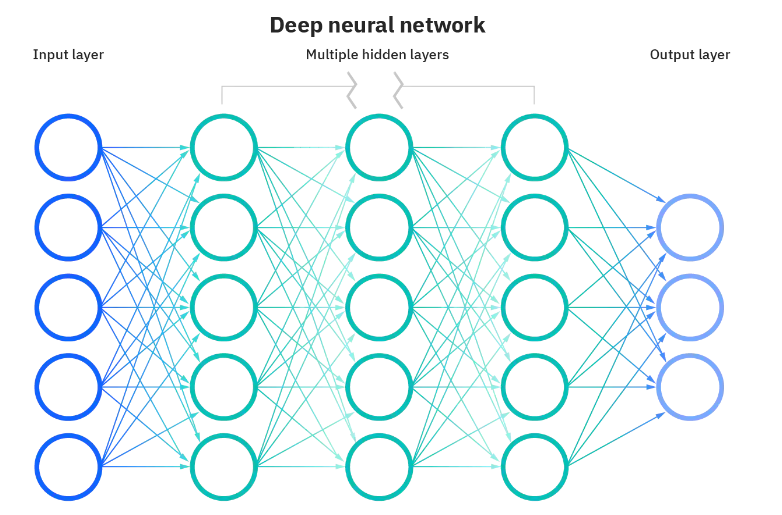
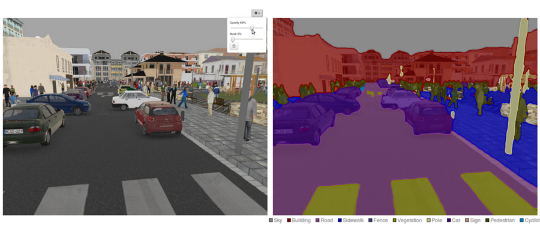

# Questions-and-Answers

# Fundamentals

### - What is Machine Learning?

Machine learning is a branch of artificial intelligence (AI) and computer science that focuses on using data and algorithms to imitate the way that humans learn, gradually improving its accuracy.

Machine learning is an important component of the growing field of data science. Through the use of statistical methods, algorithms are trained to make classifications or predictions, uncovering key insights within data mining projects.

---

*Makine öğrenimi, insanların öğrenme şeklini taklit etmek için veri ve algoritmaların kullanımına odaklanan ve doğruluğunu kademeli olarak artıran bir yapay zeka (AI) ve bilgisayar bilimi dalıdır.*

*Makine öğrenimi, büyüyen veri bilimi alanının önemli bir bileşenidir. İstatistiksel yöntemlerin kullanımı yoluyla, algoritmalar sınıflandırmalar veya tahminler yapmak için eğitilir ve veri madenciliği projelerindeki temel bilgileri ortaya çıkarır.*

### - What is Unsupervised vs Supervised learning difference?

The main distinction between the two approaches is the use of labeled datasets. To put it simply, supervised learning uses labeled input and output data, while an unsupervised learning algorithm does not.

In supervised learning, the algorithm “learns” from the training dataset by iteratively making predictions on the data and adjusting for the correct answer. While supervised learning models tend to be more accurate than unsupervised learning models, they require upfront human intervention to label the data appropriately. For example, a supervised learning model can predict how long your commute will be based on the time of day, weather conditions and so on. But first, you’ll have to train it to know that rainy weather extends the driving time.

Unsupervised learning models, in contrast, work on their own to discover the inherent structure of unlabeled data.

---

*İki yaklaşım arasındaki temel ayrım, etiketli veri kümelerinin kullanılmasıdır. Basitçe söylemek gerekirse, denetimli öğrenme etiketli girdi ve çıktı verilerini kullanırken denetimsiz öğrenme algoritması kullanmaz.*

*Denetimli öğrenmede, algoritma, veriler üzerinde yinelemeli olarak tahminler yaparak ve doğru yanıtı ayarlayarak eğitim veri kümesinden "öğrenir". Denetimli öğrenme modelleri denetimsiz öğrenme modellerinden daha doğru olma eğilimindeyken, verileri uygun şekilde etiketlemek için önceden insan müdahalesi gerektirirler. Örneğin, denetimli bir öğrenme modeli, günün saatine, hava koşullarına vb. bağlı olarak işe gidip gelme sürenizin ne kadar süreceğini tahmin edebilir. Ama önce, yağmurlu havanın sürüş süresini uzattığını bilmek için onu eğitmeniz gerekecek.*

*Bunun aksine denetimsiz öğrenme modelleri, etiketlenmemiş verilerin doğal yapısını keşfetmek için kendi başlarına çalışır.*

 

### - What is Deep Learning?

Deep learning is a subset of machine learning, which is essentially a neural network with three or more layers. These neural networks attempt to simulate the behavior of the human brain—albeit far from matching its ability—allowing it to “learn” from large amounts of data. While a neural network with a single layer can still make approximate predictions, additional hidden layers can help to optimize and refine for accuracy. 

Deep learning drives many artificial intelligence (AI) applications and services that improve automation, performing analytical and physical tasks without human intervention. Deep learning technology lies behind everyday products and services (such as digital assistants, voice-enabled TV remotes, and credit card fraud detection) as well as emerging technologies (such as self-driving cars).

---

*Derin öğrenme, temelde üç veya daha fazla katmana sahip bir sinir ağı olan makine öğreniminin bir alt kümesidir. Bu sinir ağları, insan beyninin davranışını simüle etmeye çalışır - her ne kadar kabiliyetine uymaktan uzak olsa da - büyük miktarda veriden “öğrenmesine” izin verir. Tek katmanlı bir sinir ağı hala yaklaşık tahminler yapabilirken, ek gizli katmanlar doğruluğu optimize etmeye ve iyileştirmeye yardımcı olabilir.*

*Derin öğrenme, insan müdahalesi olmadan analitik ve fiziksel görevleri gerçekleştirerek otomasyonu geliştiren birçok yapay zeka (AI) uygulamasını ve hizmetini yönlendirir. Derin öğrenme teknolojisi, günlük ürün ve hizmetlerin (dijital asistanlar, sesli TV uzaktan kumandaları ve kredi kartı sahtekarlığı tespiti gibi) yanı sıra gelişen teknolojilerin (kendi kendini süren arabalar gibi) arkasında yatar.*

### What is Neural Network (NN)?

Neural networks reflect the behavior of the human brain, allowing computer programs to recognize patterns and solve common problems in the fields of AI, machine learning, and deep learning.

Neural networks, also known as artificial neural networks (ANNs) or simulated neural networks (SNNs), are a subset of machine learning and are at the heart of deep learning algorithms. Their name and structure are inspired by the human brain, mimicking the way that biological neurons signal to one another.

Artificial neural networks (ANNs) are comprised of node layers, containing an input layer, one or more hidden layers, and an output layer. Each node, or artificial neuron, connects to another and has an associated weight and threshold. If the output of any individual node is above the specified threshold value, that node is activated, sending data to the next layer of the network.

---

*Sinir ağları, insan beyninin davranışını yansıtarak bilgisayar programlarının yapay zeka, makine öğrenimi ve derin öğrenme alanlarındaki kalıpları tanımasına ve ortak sorunları çözmesine olanak tanır.*

*Yapay sinir ağları (YSA) veya simüle edilmiş sinir ağları (SNN'ler) olarak da bilinen sinir ağları, makine öğreniminin bir alt kümesidir ve derin öğrenme algoritmalarının kalbinde yer alır. Adları ve yapıları, biyolojik nöronların birbirine sinyal gönderme şeklini taklit ederek insan beyninden esinlenmiştir.*

*Yapay sinir ağları (YSA), bir girdi katmanı, bir veya daha fazla gizli katman ve bir çıktı katmanı içeren bir düğüm katmanından oluşur. Her düğüm veya yapay nöron diğerine bağlanır ve ilişkili bir ağırlık ve eşiğe sahiptir. Herhangi bir düğümün çıktısı belirtilen eşik değerinin üzerindeyse, o düğüm etkinleştirilir ve ağın bir sonraki katmanına veri gönderilir.*

 

### What is Convolution Neural Network (CNN)? Please give 2 advantages over NN.

A Convolutional Neural Network (ConvNet/CNN) is a Deep Learning algorithm that can take in an input image, assign importance (learnable weights and biases) to various aspects/objects in the image, and differentiate one from the other. The pre-processing required in a ConvNet is much lower as compared to other classification algorithms. While in primitive methods filters are hand-engineered, with enough training, ConvNets have the ability to learn these filters/characteristics.

A ConvNet can **successfully capture the Spatial and Temporal dependencies** in an image through the application of relevant filters. The architecture performs a better fitting to the image dataset due to the reduction in the number of parameters involved and the reusability of weights.

Convolutional Neural Networks (CNN) have characteristics that enable invariance to the affine transformations of images that are fed through the network. This provides the ability to recognize patterns that are shifted, tilted or slightly warped within images.

Compared to its predecessors, the main advantage of CNN is that it automatically detects the important features without any human supervision. For example, given many pictures of cats and dogs, it can learn the key features for each class by itself.

- In CNN's, each filter is replicated across the entire visual field. These replicated units share the same parameterization (weight vector and bias) and form a feature map. This means that all the neurons in a given convolutional layer respond to the same feature within their specific response field.

    Weight sharing reduces the training time; this is a direct advantage of the reduction of the number of weight updates that have to take place during backpropagation. To reiterate weight sharing occurs when a feature map is generated from the result of the convolution between a filter and input data from a unit within a plane in the convolution layer. All units within this layer plane share the same weights; hence it is called weight/parameter sharing.

    A convolutional neural network learns certain features in images that are useful for classifying the image. Sharing parameters gives the network the ability to look for a given feature everywhere in the image, rather than in just a certain area. This is extremely useful when the object of interest could be anywhere in the image. Relaxing the parameter sharing allows the network to look for a given feature only in a specific area. For example, if your training data is centered on faces, you could end up with a network that looks for eyes, nose, and mouth in the center of the image, a curve towards the top, and shoulders towards the bottom. It is uncommon to have training data where useful features will usually always be in the same area, so this is not seen often.

- CNN captures the spatial features from an image. Spatial features refer to the arrangement of pixels and the relationship between them in an image. They help us identify the object accurately, the location of an object, and its relation with other objects in an image.

Source: [https://analyticsindiamag.com/weight-sharing-deep-learning/](https://analyticsindiamag.com/weight-sharing-deep-learning/)

---

*Bir Evrişimli Sinir Ağı (ConvNet/CNN), bir girdi görüntüsünü alabilen, görüntüdeki çeşitli yönlere/nesnelere önem (öğrenilebilir ağırlıklar ve önyargılar) atayan ve birini diğerinden ayırt edebilen bir Derin Öğrenme algoritmasıdır. Bir ConvNet'te gereken ön işleme, diğer sınıflandırma algoritmalarına kıyasla çok daha düşüktür. İlkel yöntemlerde filtreler elle tasarlanırken, yeterli eğitimle ConvNet'ler bu filtreleri/özellikleri öğrenme yeteneğine sahiptir.*

*Bir ConvNet, ilgili filtrelerin uygulanması yoluyla bir görüntüdeki Uzamsal ve Zamansal bağımlılıkları başarılı bir şekilde yakalayabilir. Mimari, ilgili parametrelerin sayısındaki azalma ve ağırlıkların yeniden kullanılabilirliği nedeniyle görüntü veri kümesine daha iyi uyum sağlar.*

*Evrişimli Sinir Ağları (CNN), ağ üzerinden beslenen görüntülerin afin dönüşümlerine değişmezlik sağlayan özelliklere sahiptir. Bu, görüntüler içinde kaydırılan, eğilen veya hafif çarpık desenleri tanıma yeteneği sağlar.*

*CNN'nin öncekilere kıyasla en büyük avantajı, önemli özellikleri herhangi bir insan denetimi olmadan otomatik olarak algılamasıdır. Örneğin, birçok kedi ve köpek resmi verildiğinde, her sınıf için temel özellikleri kendi kendine öğrenebilir.*

- *CNN'de, her filtre tüm görsel alan boyunca çoğaltılır. Bu çoğaltılmış birimler aynı parametreleştirmeyi (ağırlık vektörü ve sapma) paylaşır ve bir özellik haritası oluşturur. Bu, belirli bir evrişim katmanındaki tüm nöronların, kendi özel yanıt alanlarında aynı özelliğe yanıt verdiği anlamına gelir.*

    *Ağırlık paylaşımı eğitim süresini kısaltır; bu, geri yayılım sırasında gerçekleşmesi gereken ağırlık güncellemelerinin sayısının azaltılmasının doğrudan bir avantajıdır. Ağırlık paylaşımını yinelemek, evrişim katmanındaki bir düzlem içindeki bir birimden gelen bir filtre ile girdi verileri arasındaki evrişimin sonucundan bir özellik haritası oluşturulduğunda gerçekleşir. Bu katman düzlemindeki tüm birimler aynı ağırlıkları paylaşır; dolayısıyla buna ağırlık/parametre paylaşımı denir.*

    *Bir evrişimli sinir ağı, görüntülerde, görüntüyü sınıflandırmak için yararlı olan belirli özellikleri öğrenir. Parametrelerin paylaşılması, ağa belirli bir alanda değil, görüntünün her yerinde belirli bir özelliği arama yeteneği verir. Bu, ilgilenilen nesne görüntünün herhangi bir yerinde olabileceği durumlarda son derece kullanışlıdır. Parametre paylaşımının gevşetilmesi, ağın belirli bir özelliği yalnızca belirli bir alanda aramasını sağlar. Örneğin, eğitim verileriniz yüzlere odaklanmışsa, görüntünün merkezinde gözler, burun ve ağız, yukarı doğru bir eğri ve alta doğru omuzlar arayan bir ağ elde edebilirsiniz. Yararlı özelliklerin genellikle her zaman aynı alanda olacağı eğitim verilerine sahip olmak nadirdir, bu nedenle bu sık görülmez.*

- *CNN, bir görüntüden uzamsal özellikleri yakalar. Uzamsal özellikler, bir görüntüdeki piksellerin düzenini ve aralarındaki ilişkiyi ifade eder. Nesneyi, bir nesnenin konumunu ve bir görüntüdeki diğer nesnelerle ilişkisini doğru bir şekilde tanımlamamıza yardımcı olurlar.*

### What is segmentation task in NN? Is it supervised or unsupervised?

Nowadays, **semantic segmentation** is one of the key problems in the field of computer vision. The importance of scene understanding as a core computer vision problem is highlighted by the fact that an increasing number of applications nourish from inferring knowledge from imagery. Some of those applications include self-driving vehicles, human-computer interaction, virtual reality etc. With the popularity of deep learning in recent years, many semantic segmentation problems are being tackled using deep architectures, most often Convolutional Neural Nets, which surpass other approaches by a large margin in terms of accuracy and efficiency.

Semantic segmentation is a natural step in the progression from coarse to fine inference: The origin could be located at classification, which consists of making a prediction for a whole input. The next step is **localization / detection**, which provide not only the classes but also additional information regarding the spatial location of those classes. Finally, semantic segmentation achieves fine-grained inference by making dense predictions inferring labels for every pixel so that each pixel is labeled with the class of its enclosing object or region.

---

*Günümüzde anlamsal bölütleme, bilgisayarla görme alanındaki temel problemlerden biridir. Temel bir bilgisayar görme problemi olarak sahne anlamanın önemi, artan sayıda uygulamanın görüntüden bilgi çıkarımından beslenmesi gerçeğiyle vurgulanmaktadır. Bu uygulamalardan bazıları, kendi kendini süren araçlar, insan-bilgisayar etkileşimi, sanal gerçeklik vb. Son yıllarda derin öğrenmenin popülaritesi ile birlikte, doğruluk ve verimlilik açısından diğer yaklaşımları büyük bir farkla geride bırakan, çoğu zaman Evrişimsel Sinir Ağları olmak üzere derin mimariler kullanılarak birçok anlamsal segmentasyon sorunu ele alınmaktadır.*

*Semantik segmentasyon, kaba çıkarımdan ince çıkarıma ilerlemede doğal bir adımdır: Köken, tüm girdi için bir tahmin yapmaktan oluşan sınıflandırmada bulunabilir. Bir sonraki adım, yalnızca sınıfları değil, aynı zamanda bu sınıfların uzamsal konumuyla ilgili ek bilgileri de sağlayan yerelleştirme / algılamadır. Son olarak, anlamsal bölütleme, her piksel için etiketler çıkaran yoğun tahminler yaparak ince taneli çıkarımı gerçekleştirir, böylece her piksel, çevreleyen nesne veya bölgenin sınıfıyla etiketlenir.*

 

**What are the existing Semantic Segmentation approaches?**

A general semantic segmentation architecture can be broadly thought of as an **encoder** network followed by a **decoder** network:

- The **encoder** is usually is a pre-trained classification network like VGG/ResNet followed by a decoder network.
- The task of the **decoder** is to semantically project the discriminative features (lower resolution) learned by the encoder onto the pixel space (higher resolution) to get a dense classification.

Source: [https://nanonets.com/blog/how-to-do-semantic-segmentation-using-deep-learning/](https://nanonets.com/blog/how-to-do-semantic-segmentation-using-deep-learning/)

---

*Genel bir semantik segmentasyon mimarisi, genel olarak bir kodlayıcı ağı ve ardından bir kod çözücü ağı olarak düşünülebilir:*

- *Kodlayıcı genellikle VGG/ResNet gibi önceden eğitilmiş bir sınıflandırma ağı ve ardından bir kod çözücü ağıdır.*
- *Kod çözücünün görevi, yoğun bir sınıflandırma elde etmek için kodlayıcı tarafından öğrenilen ayırt edici özellikleri (düşük çözünürlük) piksel uzayına (daha yüksek çözünürlük) anlamsal olarak yansıtmaktır.*

### What is classification task in NN? Is it supervised or unsupervised?

Artificial Neural Network applications are generally used in prediction, classification, data association, data interpretation and data filtering. Artificial neural networks used for classification take on the task of classifying input values. Classification is the categorization process in which objects are defined, differentiated and data is understood on the basis of the training set. Classification is a supervised learning technique with a training set and correctly defined observations. All classification tasks depend upon labeled datasets; that is, humans must transfer their knowledge to the dataset in order for a neural network to learn the correlation between labels and data. This is known as supervised learning.

- Detect faces, identify people in images, recognize facial expressions (angry, joyful)
- Identify objects in images (stop signs, pedestrians, lane markers…)
- Recognize gestures in video
- Detect voices, identify speakers, transcribe speech to text, recognize sentiment invoices
- Classify text as spam (in emails) or fraudulent (in insurance claims); recognize sentiment in text (customer feedback)

---

*Yapay Sinir Ağları uygulamaları genellikle tahmin, sınıflandırma, veri ilişkilendirme, veri yorumlama ve veri filtreleme işlemlerinde kullanılmaktadır. Sınıflandırma amacıyla kullanılan yapay sinir ağları, girdi değerlerini sınıflama görevini üstlenirler. Sınıflandırma, nesnelerin tanımlandığı, farklılaştığı ve verilerin eğitim seti temelinde anlaşıldığı kategorizasyon sürecidir. Sınıflandırma, bir eğitim seti ve doğru tanımlanmış gözlemlerin bulunduğu denetimli bir öğrenme tekniğidir. Tüm sınıflandırma görevleri, etiketlenmiş veri kümelerine bağlıdır; yani, bir sinir ağının etiketler ve veriler arasındaki ilişkiyi öğrenmesi için insanların bilgilerini veri kümesine aktarması gerekir. Bu, denetimli öğrenme olarak bilinir.*

- *Yüz algılama, görüntülerdeki insanları tanımlama, yüz ifadelerini tanıma (kızgın, neşeli)*
- *Görüntülerdeki nesneleri tanımlama (dur işaretleri, yayalar, şerit işaretleri…)*
- *Videodaki hareketleri tanıma*
- *Sesleri algılama, konuşmacıları tanımlama, konuşmayı metne dönüştürme, seslerdeki duyguyu tanıma*
- *Metni spam (e-postalarda) veya hileli (sigorta taleplerinde) olarak sınıflandırma; metindeki duyarlılığı tanıma (müşteri geri bildirimi).*

### Compare segmentation and classification in NN.

**WHAT IS CLASSIFICATION?**

Classification refers to a type of labeling where an image/video is assigned certain concepts, with the goal of answering the question, “What is in this image/video?”

The classification process is easier than segmentation, in classification all objects in a single image is grouped or categorized into a single class. While in segmentation each object of a single class in an image is highlighted with different shades to make them recognizable to computer vision.

**WHAT IS SEGMENTATION?**

Segmentation is a type of labeling where each pixel in an image is labeled with given concepts. Here, whole images are divided into pixel groupings that can then be labeled and classified to simplify an image or change how an image is presented to the model to make it easier to analyze.

Segmentation models provide the exact outline of the object within an image. That is, pixel by pixel details are provided for a given object, as opposed to Classification models, where the model identifies what is in an image, and Detection models, which places a bounding box around specific objects.

Source: [https://www.clarifai.com/blog/classification-vs-detection-vs-segmentation-models-the-differences-between-them-and-how-each-impact-your-results](https://www.clarifai.com/blog/classification-vs-detection-vs-segmentation-models-the-differences-between-them-and-how-each-impact-your-results)

---

***SINIFLANDIRMA NEDİR?***

*Sınıflandırma, "Bu resimde/videoda ne var?" sorusunu yanıtlamak amacıyla bir görüntüye/videoya belirli kavramların atandığı bir etiketleme türünü ifade eder.*

*Sınıflandırma işlemi segmentasyondan daha kolaydır, sınıflandırmada tek bir görüntüdeki tüm nesneler tek bir sınıfa gruplanır veya kategorize edilir. Segmentasyon sırasında, bir görüntüdeki tek bir sınıfın her bir nesnesi, bilgisayarla görüye tanınabilmesi için farklı gölgelerle vurgulanır.*

***SEGMENTASYON NEDİR?***

*Segmentasyon, bir görüntüdeki her pikselin verilen kavramlarla etiketlendiği bir etiketleme türüdür. Burada, tüm görüntüler, analiz etmeyi kolaylaştırmak için bir görüntüyü basitleştirmek veya bir görüntünün modele sunulma şeklini değiştirmek amacıyla etiketlenip sınıflandırılabilen piksel gruplarına ayrılır.*

*Segmentasyon modelleri, bir görüntü içindeki nesnenin tam ana hatlarını sağlar. Yani, modelin bir görüntüde ne olduğunu tanımladığı Sınıflandırma modellerinin ve belirli nesnelerin çevresine bir sınırlayıcı kutu yerleştiren Tespit modellerinin aksine, belirli bir nesne için piksel piksel ayrıntılar sağlanır.*

### What is data and dataset difference?

- **Data** are observations or measurements (unprocessed or processed) represented as text, numbers, or multimedia.
- A **dataset** is a structured collection of data generally associated with a unique body of work.

---

- **Veriler**, metin, sayılar veya multimedya olarak temsil edilen gözlemler veya ölçümlerdir (işlenmemiş veya işlenmiş).
- **Veri kümesi**, genellikle benzersiz bir çalışma grubuyla ilişkili yapılandırılmış bir veri topluluğudur.

### What is the difference between supervised and unsupervised learning in terms of dataset?

In a **supervised learning** model, the algorithm learns on a **labeled dataset**, providing an answer key that the algorithm can use to evaluate its accuracy on training data. An **unsupervised** model, in contrast, provides **unlabeled data** that the algorithm tries to make sense of by extracting features and patterns on its own.

> Supervised → Input and label  
Unsupervised → Input

---

*Denetimli bir öğrenme modelinde, algoritma etiketli bir veri kümesi üzerinde öğrenir ve algoritmanın eğitim verileri üzerindeki doğruluğunu değerlendirmek için kullanabileceği bir cevap anahtarı sağlar. Denetimsiz bir model, aksine, algoritmanın kendi başına özellikleri ve kalıpları çıkararak anlamlandırmaya çalıştığı etiketlenmemiş verileri sağlar.*

# Preprocess

## Extracting Masks

### What is color space?

