# Questions and Answers

## Contents
### Fundamentals
- [What is Machine Learning?](#--What-is-Machine-Learning?)
- [What is Unsupervised vs Supervised learning difference?](#--What-is-Unsupervised-vs-Supervised-learning-difference?)
- [What is Deep Learning?](#--What-is-Deep-Learning?)
- [What is Neural Network (NN)?](#--What-is-Neural-Network-(NN)?)
- [What is Convolution Neural Network (CNN)? Please give 2 advantages over NN.](#--What-is-Convolution-Neural-Network-(CNN)?-Please-give-2-advantages-over-NN.)
- [What is segmentation task in NN? Is it supervised or unsupervised?](#--What-is-segmentation-task-in-NN?-Is-it-supervised-or-unsupervised?)
- [What is classification task in NN? Is it supervised or unsupervised?](#--What-is-classification-task-in-NN?-Is-it-supervised-or-unsupervised?)
- [Compare segmentation and classification in NN.](#--Compare-segmentation-and-classification-in-NN.)
- [What is data and dataset difference?](#--What-is-data-and-dataset-difference?)
- [What is the difference between supervised and unsupervised learning in terms of dataset?](#--What-is-the-difference-between-supervised-and-unsupervised-learning-in-terms-of-dataset?)

### Data Preprocessing
**Extracting Masks**
- [What is color space?](#--What-is-color-space?)
- [What RGB stands for?](#--What-RGB-stands-for?)
- [In Python, can we transform from one color space to another?](#--In-Python,-can-we-transform-from-one-color-space-to-another?)
- [What is the popular library for image processing?](#--What-is-the-popular-library-for-image-processing?)

**Converting into Tensor**
- [Computational Graph](#--Computational-Graph)
- [What is Tensor?](#--What-is-Tensor?)
- [One Hot Encoding](#--One-Hot-Encoding)
- [What is CUDA programming?](#--What-is-CUDA-programming?)

### Design Segmentation Model
- [What is the difference between CNN and Fully CNN (FCNN)?](#--What-is-the-difference-between-CNN-and-Fully-CNN-(FCNN)-?)
- [What are the different layers on CNN?](#--What-are-the-different-layers-on-CNN?)
- [What is activation function ? Why is softmax usually used in the last layer?](#--What-is-activation-function-?-Why-is-softmax-usually-used-in-the-last-layer?)

### Train
- [What is parameter and hyper-parameter in NN ?](#--What-is-parameter-and-hyper-parameter-in-NN-?)
- [Validation Set](#--Validation-Set)
- [What is an epoch?](#--What-is-an-epoch?)
- [What is batch?](#--What-is-batch?)
- [What is iteration?](#--What-is-iteration?)
- [What is Cost Function?](#--What-is-Cost-Function?)
- [What is/are the purpose(s) of an optimizer in NN?](#--What-is/are-the-purpose(s)-of-an-optimizer-in-NN?)
- [What is Batch Gradient Descent & Stochastic Gradient Descent?](#--What-is-Batch-Gradient-Descent-&-Stochastic-Gradient-Descent?)
- [What is Backpropogation? What is used for?](#--What-is-Backpropogation-?-What-is-used-for-?)
---

## Fundamentals
### - What is Machine Learning?

Machine learning is a branch of artificial intelligence (AI) and computer science that focuses on using data and algorithms to imitate the way that humans learn, gradually improving its accuracy.

Machine learning is an important component of the growing field of data science. Through the use of statistical methods, algorithms are trained to make classifications or predictions, uncovering key insights within data mining projects.

---

*Makine öğrenimi, insanların öğrenme şeklini taklit etmek için veri ve algoritmaların kullanımına odaklanan ve doğruluğunu kademeli olarak artıran bir yapay zeka (AI) ve bilgisayar bilimi dalıdır.*

*Makine öğrenimi, büyüyen veri bilimi alanının önemli bir bileşenidir. İstatistiksel yöntemlerin kullanımı yoluyla, algoritmalar sınıflandırmalar veya tahminler yapmak için eğitilir ve veri madenciliği projelerindeki temel bilgileri ortaya çıkarır.*

### - What is Unsupervised vs Supervised learning difference?

The main distinction between the two approaches is the use of labeled datasets. To put it simply, supervised learning uses labeled input and output data, while an unsupervised learning algorithm does not.

In supervised learning, the algorithm “learns” from the training dataset by iteratively making predictions on the data and adjusting for the correct answer. While supervised learning models tend to be more accurate than unsupervised learning models, they require upfront human intervention to label the data appropriately. For example, a supervised learning model can predict how long your commute will be based on the time of day, weather conditions and so on. But first, you’ll have to train it to know that rainy weather extends the driving time.

Unsupervised learning models, in contrast, work on their own to discover the inherent structure of unlabeled data.

---

*İki yaklaşım arasındaki temel ayrım, etiketli veri kümelerinin kullanılmasıdır. Basitçe söylemek gerekirse, denetimli öğrenme etiketli girdi ve çıktı verilerini kullanırken denetimsiz öğrenme algoritması kullanmaz.*

*Denetimli öğrenmede, algoritma, veriler üzerinde yinelemeli olarak tahminler yaparak ve doğru yanıtı ayarlayarak eğitim veri kümesinden "öğrenir". Denetimli öğrenme modelleri denetimsiz öğrenme modellerinden daha doğru olma eğilimindeyken, verileri uygun şekilde etiketlemek için önceden insan müdahalesi gerektirirler. Örneğin, denetimli bir öğrenme modeli, günün saatine, hava koşullarına vb. bağlı olarak işe gidip gelme sürenizin ne kadar süreceğini tahmin edebilir. Ama önce, yağmurlu havanın sürüş süresini uzattığını bilmek için onu eğitmeniz gerekecek.*

*Bunun aksine denetimsiz öğrenme modelleri, etiketlenmemiş verilerin doğal yapısını keşfetmek için kendi başlarına çalışır.*

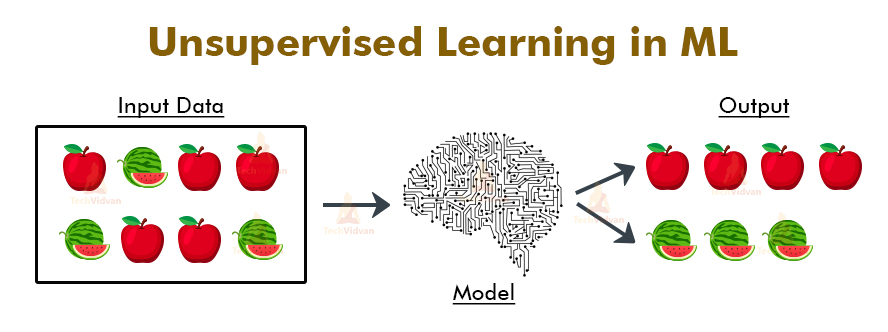

 

### - What is Deep Learning?

Deep learning is a subset of machine learning, which is essentially a neural network with three or more layers. These neural networks attempt to simulate the behavior of the human brain—albeit far from matching its ability—allowing it to “learn” from large amounts of data. While a neural network with a single layer can still make approximate predictions, additional hidden layers can help to optimize and refine for accuracy. 

Deep learning drives many artificial intelligence (AI) applications and services that improve automation, performing analytical and physical tasks without human intervention. Deep learning technology lies behind everyday products and services (such as digital assistants, voice-enabled TV remotes, and credit card fraud detection) as well as emerging technologies (such as self-driving cars).

---

*Derin öğrenme, temelde üç veya daha fazla katmana sahip bir sinir ağı olan makine öğreniminin bir alt kümesidir. Bu sinir ağları, insan beyninin davranışını simüle etmeye çalışır - her ne kadar kabiliyetine uymaktan uzak olsa da - büyük miktarda veriden “öğrenmesine” izin verir. Tek katmanlı bir sinir ağı hala yaklaşık tahminler yapabilirken, ek gizli katmanlar doğruluğu optimize etmeye ve iyileştirmeye yardımcı olabilir.*

*Derin öğrenme, insan müdahalesi olmadan analitik ve fiziksel görevleri gerçekleştirerek otomasyonu geliştiren birçok yapay zeka (AI) uygulamasını ve hizmetini yönlendirir. Derin öğrenme teknolojisi, günlük ürün ve hizmetlerin (dijital asistanlar, sesli TV uzaktan kumandaları ve kredi kartı sahtekarlığı tespiti gibi) yanı sıra gelişen teknolojilerin (kendi kendini süren arabalar gibi) arkasında yatar.*

### - What is Neural Network (NN)?

Neural networks reflect the behavior of the human brain, allowing computer programs to recognize patterns and solve common problems in the fields of AI, machine learning, and deep learning.

Neural networks, also known as artificial neural networks (ANNs) or simulated neural networks (SNNs), are a subset of machine learning and are at the heart of deep learning algorithms. Their name and structure are inspired by the human brain, mimicking the way that biological neurons signal to one another.

Artificial neural networks (ANNs) are comprised of node layers, containing an input layer, one or more hidden layers, and an output layer. Each node, or artificial neuron, connects to another and has an associated weight and threshold. If the output of any individual node is above the specified threshold value, that node is activated, sending data to the next layer of the network.

---

*Sinir ağları, insan beyninin davranışını yansıtarak bilgisayar programlarının yapay zeka, makine öğrenimi ve derin öğrenme alanlarındaki kalıpları tanımasına ve ortak sorunları çözmesine olanak tanır.*

*Yapay sinir ağları (YSA) veya simüle edilmiş sinir ağları (SNN'ler) olarak da bilinen sinir ağları, makine öğreniminin bir alt kümesidir ve derin öğrenme algoritmalarının kalbinde yer alır. Adları ve yapıları, biyolojik nöronların birbirine sinyal gönderme şeklini taklit ederek insan beyninden esinlenmiştir.*

*Yapay sinir ağları (YSA), bir girdi katmanı, bir veya daha fazla gizli katman ve bir çıktı katmanı içeren bir düğüm katmanından oluşur. Her düğüm veya yapay nöron diğerine bağlanır ve ilişkili bir ağırlık ve eşiğe sahiptir. Herhangi bir düğümün çıktısı belirtilen eşik değerinin üzerindeyse, o düğüm etkinleştirilir ve ağın bir sonraki katmanına veri gönderilir.*

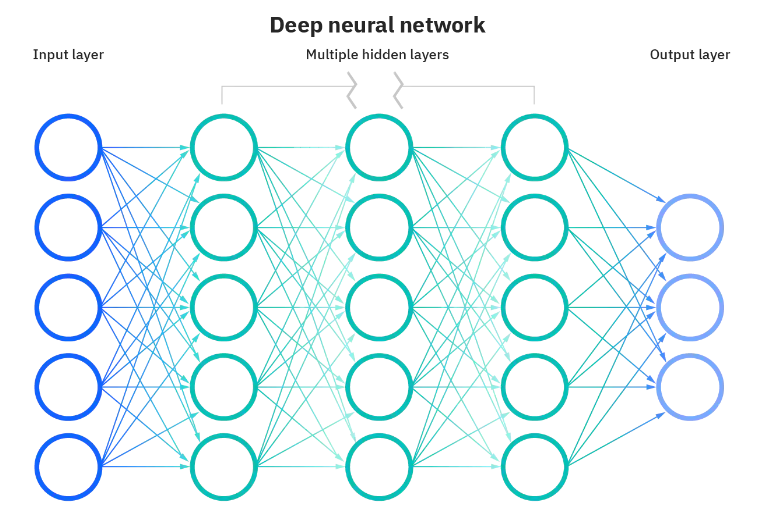

 

### - What is Convolution Neural Network (CNN)? Please give 2 advantages over NN.

A Convolutional Neural Network (ConvNet/CNN) is a Deep Learning algorithm that can take in an input image, assign importance (learnable weights and biases) to various aspects/objects in the image, and differentiate one from the other. The pre-processing required in a ConvNet is much lower as compared to other classification algorithms. While in primitive methods filters are hand-engineered, with enough training, ConvNets have the ability to learn these filters/characteristics.

A ConvNet can **successfully capture the Spatial and Temporal dependencies** in an image through the application of relevant filters. The architecture performs a better fitting to the image dataset due to the reduction in the number of parameters involved and the reusability of weights.

Convolutional Neural Networks (CNN) have characteristics that enable invariance to the affine transformations of images that are fed through the network. This provides the ability to recognize patterns that are shifted, tilted or slightly warped within images.

Compared to its predecessors, the main advantage of CNN is that it automatically detects the important features without any human supervision. For example, given many pictures of cats and dogs, it can learn the key features for each class by itself.

- In CNN's, each filter is replicated across the entire visual field. These replicated units share the same parameterization (weight vector and bias) and form a feature map. This means that all the neurons in a given convolutional layer respond to the same feature within their specific response field.

    Weight sharing reduces the training time; this is a direct advantage of the reduction of the number of weight updates that have to take place during backpropagation. To reiterate weight sharing occurs when a feature map is generated from the result of the convolution between a filter and input data from a unit within a plane in the convolution layer. All units within this layer plane share the same weights; hence it is called weight/parameter sharing.

    A convolutional neural network learns certain features in images that are useful for classifying the image. Sharing parameters gives the network the ability to look for a given feature everywhere in the image, rather than in just a certain area. This is extremely useful when the object of interest could be anywhere in the image. Relaxing the parameter sharing allows the network to look for a given feature only in a specific area. For example, if your training data is centered on faces, you could end up with a network that looks for eyes, nose, and mouth in the center of the image, a curve towards the top, and shoulders towards the bottom. It is uncommon to have training data where useful features will usually always be in the same area, so this is not seen often.

- CNN captures the spatial features from an image. Spatial features refer to the arrangement of pixels and the relationship between them in an image. They help us identify the object accurately, the location of an object, and its relation with other objects in an image.

Source: [https://analyticsindiamag.com/weight-sharing-deep-learning/](https://analyticsindiamag.com/weight-sharing-deep-learning/)

---

*Bir Evrişimli Sinir Ağı (ConvNet/CNN), bir girdi görüntüsünü alabilen, görüntüdeki çeşitli yönlere/nesnelere önem (öğrenilebilir ağırlıklar ve önyargılar) atayan ve birini diğerinden ayırt edebilen bir Derin Öğrenme algoritmasıdır. Bir ConvNet'te gereken ön işleme, diğer sınıflandırma algoritmalarına kıyasla çok daha düşüktür. İlkel yöntemlerde filtreler elle tasarlanırken, yeterli eğitimle ConvNet'ler bu filtreleri/özellikleri öğrenme yeteneğine sahiptir.*

*Bir ConvNet, ilgili filtrelerin uygulanması yoluyla bir görüntüdeki Uzamsal ve Zamansal bağımlılıkları başarılı bir şekilde yakalayabilir. Mimari, ilgili parametrelerin sayısındaki azalma ve ağırlıkların yeniden kullanılabilirliği nedeniyle görüntü veri kümesine daha iyi uyum sağlar.*

*Evrişimli Sinir Ağları (CNN), ağ üzerinden beslenen görüntülerin afin dönüşümlerine değişmezlik sağlayan özelliklere sahiptir. Bu, görüntüler içinde kaydırılan, eğilen veya hafif çarpık desenleri tanıma yeteneği sağlar.*

*CNN'nin öncekilere kıyasla en büyük avantajı, önemli özellikleri herhangi bir insan denetimi olmadan otomatik olarak algılamasıdır. Örneğin, birçok kedi ve köpek resmi verildiğinde, her sınıf için temel özellikleri kendi kendine öğrenebilir.*

- *CNN'de, her filtre tüm görsel alan boyunca çoğaltılır. Bu çoğaltılmış birimler aynı parametreleştirmeyi (ağırlık vektörü ve sapma) paylaşır ve bir özellik haritası oluşturur. Bu, belirli bir evrişim katmanındaki tüm nöronların, kendi özel yanıt alanlarında aynı özelliğe yanıt verdiği anlamına gelir.*

    *Ağırlık paylaşımı eğitim süresini kısaltır; bu, geri yayılım sırasında gerçekleşmesi gereken ağırlık güncellemelerinin sayısının azaltılmasının doğrudan bir avantajıdır. Ağırlık paylaşımını yinelemek, evrişim katmanındaki bir düzlem içindeki bir birimden gelen bir filtre ile girdi verileri arasındaki evrişimin sonucundan bir özellik haritası oluşturulduğunda gerçekleşir. Bu katman düzlemindeki tüm birimler aynı ağırlıkları paylaşır; dolayısıyla buna ağırlık/parametre paylaşımı denir.*

    *Bir evrişimli sinir ağı, görüntülerde, görüntüyü sınıflandırmak için yararlı olan belirli özellikleri öğrenir. Parametrelerin paylaşılması, ağa belirli bir alanda değil, görüntünün her yerinde belirli bir özelliği arama yeteneği verir. Bu, ilgilenilen nesne görüntünün herhangi bir yerinde olabileceği durumlarda son derece kullanışlıdır. Parametre paylaşımının gevşetilmesi, ağın belirli bir özelliği yalnızca belirli bir alanda aramasını sağlar. Örneğin, eğitim verileriniz yüzlere odaklanmışsa, görüntünün merkezinde gözler, burun ve ağız, yukarı doğru bir eğri ve alta doğru omuzlar arayan bir ağ elde edebilirsiniz. Yararlı özelliklerin genellikle her zaman aynı alanda olacağı eğitim verilerine sahip olmak nadirdir, bu nedenle bu sık görülmez.*

- *CNN, bir görüntüden uzamsal özellikleri yakalar. Uzamsal özellikler, bir görüntüdeki piksellerin düzenini ve aralarındaki ilişkiyi ifade eder. Nesneyi, bir nesnenin konumunu ve bir görüntüdeki diğer nesnelerle ilişkisini doğru bir şekilde tanımlamamıza yardımcı olurlar.*

### - What is segmentation task in NN? Is it supervised or unsupervised?

Nowadays, **semantic segmentation** is one of the key problems in the field of computer vision. The importance of scene understanding as a core computer vision problem is highlighted by the fact that an increasing number of applications nourish from inferring knowledge from imagery. Some of those applications include self-driving vehicles, human-computer interaction, virtual reality etc. With the popularity of deep learning in recent years, many semantic segmentation problems are being tackled using deep architectures, most often Convolutional Neural Nets, which surpass other approaches by a large margin in terms of accuracy and efficiency.

Semantic segmentation is a natural step in the progression from coarse to fine inference: The origin could be located at classification, which consists of making a prediction for a whole input. The next step is **localization / detection**, which provide not only the classes but also additional information regarding the spatial location of those classes. Finally, semantic segmentation achieves fine-grained inference by making dense predictions inferring labels for every pixel so that each pixel is labeled with the class of its enclosing object or region.

---

*Günümüzde anlamsal bölütleme, bilgisayarla görme alanındaki temel problemlerden biridir. Temel bir bilgisayar görme problemi olarak sahne anlamanın önemi, artan sayıda uygulamanın görüntüden bilgi çıkarımından beslenmesi gerçeğiyle vurgulanmaktadır. Bu uygulamalardan bazıları, kendi kendini süren araçlar, insan-bilgisayar etkileşimi, sanal gerçeklik vb. Son yıllarda derin öğrenmenin popülaritesi ile birlikte, doğruluk ve verimlilik açısından diğer yaklaşımları büyük bir farkla geride bırakan, çoğu zaman Evrişimsel Sinir Ağları olmak üzere derin mimariler kullanılarak birçok anlamsal segmentasyon sorunu ele alınmaktadır.*

*Semantik segmentasyon, kaba çıkarımdan ince çıkarıma ilerlemede doğal bir adımdır: Köken, tüm girdi için bir tahmin yapmaktan oluşan sınıflandırmada bulunabilir. Bir sonraki adım, yalnızca sınıfları değil, aynı zamanda bu sınıfların uzamsal konumuyla ilgili ek bilgileri de sağlayan yerelleştirme / algılamadır. Son olarak, anlamsal bölütleme, her piksel için etiketler çıkaran yoğun tahminler yaparak ince taneli çıkarımı gerçekleştirir, böylece her piksel, çevreleyen nesne veya bölgenin sınıfıyla etiketlenir.*

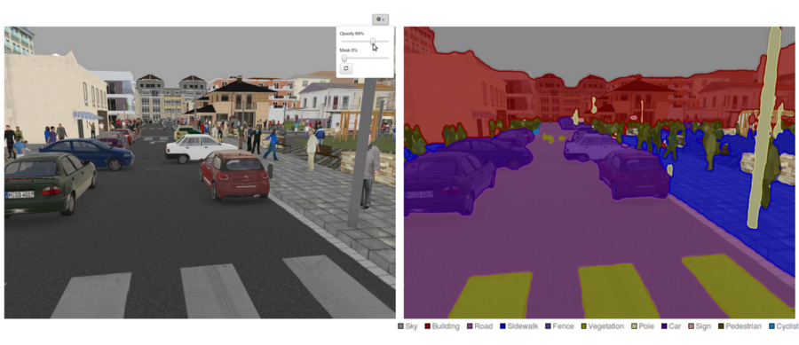

 

**What are the existing Semantic Segmentation approaches?**

A general semantic segmentation architecture can be broadly thought of as an **encoder** network followed by a **decoder** network:

- The **encoder** is usually is a pre-trained classification network like VGG/ResNet followed by a decoder network.
- The task of the **decoder** is to semantically project the discriminative features (lower resolution) learned by the encoder onto the pixel space (higher resolution) to get a dense classification.

Source: [https://nanonets.com/blog/how-to-do-semantic-segmentation-using-deep-learning/](https://nanonets.com/blog/how-to-do-semantic-segmentation-using-deep-learning/)

---

*Genel bir semantik segmentasyon mimarisi, genel olarak bir kodlayıcı ağı ve ardından bir kod çözücü ağı olarak düşünülebilir:*

- *Kodlayıcı genellikle VGG/ResNet gibi önceden eğitilmiş bir sınıflandırma ağı ve ardından bir kod çözücü ağıdır.*
- *Kod çözücünün görevi, yoğun bir sınıflandırma elde etmek için kodlayıcı tarafından öğrenilen ayırt edici özellikleri (düşük çözünürlük) piksel uzayına (daha yüksek çözünürlük) anlamsal olarak yansıtmaktır.*

### - What is classification task in NN? Is it supervised or unsupervised?

Artificial Neural Network applications are generally used in prediction, classification, data association, data interpretation and data filtering. Artificial neural networks used for classification take on the task of classifying input values. Classification is the categorization process in which objects are defined, differentiated and data is understood on the basis of the training set. Classification is a supervised learning technique with a training set and correctly defined observations. All classification tasks depend upon labeled datasets; that is, humans must transfer their knowledge to the dataset in order for a neural network to learn the correlation between labels and data. This is known as supervised learning.

- Detect faces, identify people in images, recognize facial expressions (angry, joyful)
- Identify objects in images (stop signs, pedestrians, lane markers…)
- Recognize gestures in video
- Detect voices, identify speakers, transcribe speech to text, recognize sentiment invoices
- Classify text as spam (in emails) or fraudulent (in insurance claims); recognize sentiment in text (customer feedback)

---

*Yapay Sinir Ağları uygulamaları genellikle tahmin, sınıflandırma, veri ilişkilendirme, veri yorumlama ve veri filtreleme işlemlerinde kullanılmaktadır. Sınıflandırma amacıyla kullanılan yapay sinir ağları, girdi değerlerini sınıflama görevini üstlenirler. Sınıflandırma, nesnelerin tanımlandığı, farklılaştığı ve verilerin eğitim seti temelinde anlaşıldığı kategorizasyon sürecidir. Sınıflandırma, bir eğitim seti ve doğru tanımlanmış gözlemlerin bulunduğu denetimli bir öğrenme tekniğidir. Tüm sınıflandırma görevleri, etiketlenmiş veri kümelerine bağlıdır; yani, bir sinir ağının etiketler ve veriler arasındaki ilişkiyi öğrenmesi için insanların bilgilerini veri kümesine aktarması gerekir. Bu, denetimli öğrenme olarak bilinir.*

- *Yüz algılama, görüntülerdeki insanları tanımlama, yüz ifadelerini tanıma (kızgın, neşeli)*
- *Görüntülerdeki nesneleri tanımlama (dur işaretleri, yayalar, şerit işaretleri…)*
- *Videodaki hareketleri tanıma*
- *Sesleri algılama, konuşmacıları tanımlama, konuşmayı metne dönüştürme, seslerdeki duyguyu tanıma*
- *Metni spam (e-postalarda) veya hileli (sigorta taleplerinde) olarak sınıflandırma; metindeki duyarlılığı tanıma (müşteri geri bildirimi).*

### - Compare segmentation and classification in NN.

**WHAT IS CLASSIFICATION?**

Classification refers to a type of labeling where an image/video is assigned certain concepts, with the goal of answering the question, “What is in this image/video?”

The classification process is easier than segmentation, in classification all objects in a single image is grouped or categorized into a single class. While in segmentation each object of a single class in an image is highlighted with different shades to make them recognizable to computer vision.

**WHAT IS SEGMENTATION?**

Segmentation is a type of labeling where each pixel in an image is labeled with given concepts. Here, whole images are divided into pixel groupings that can then be labeled and classified to simplify an image or change how an image is presented to the model to make it easier to analyze.

Segmentation models provide the exact outline of the object within an image. That is, pixel by pixel details are provided for a given object, as opposed to Classification models, where the model identifies what is in an image, and Detection models, which places a bounding box around specific objects.

Source: [https://www.clarifai.com/blog/classification-vs-detection-vs-segmentation-models-the-differences-between-them-and-how-each-impact-your-results](https://www.clarifai.com/blog/classification-vs-detection-vs-segmentation-models-the-differences-between-them-and-how-each-impact-your-results)

---

***SINIFLANDIRMA NEDİR?***

*Sınıflandırma, "Bu resimde/videoda ne var?" sorusunu yanıtlamak amacıyla bir görüntüye/videoya belirli kavramların atandığı bir etiketleme türünü ifade eder.*

*Sınıflandırma işlemi segmentasyondan daha kolaydır, sınıflandırmada tek bir görüntüdeki tüm nesneler tek bir sınıfa gruplanır veya kategorize edilir. Segmentasyon sırasında, bir görüntüdeki tek bir sınıfın her bir nesnesi, bilgisayarla görüye tanınabilmesi için farklı gölgelerle vurgulanır.*

***SEGMENTASYON NEDİR?***

*Segmentasyon, bir görüntüdeki her pikselin verilen kavramlarla etiketlendiği bir etiketleme türüdür. Burada, tüm görüntüler, analiz etmeyi kolaylaştırmak için bir görüntüyü basitleştirmek veya bir görüntünün modele sunulma şeklini değiştirmek amacıyla etiketlenip sınıflandırılabilen piksel gruplarına ayrılır.*

*Segmentasyon modelleri, bir görüntü içindeki nesnenin tam ana hatlarını sağlar. Yani, modelin bir görüntüde ne olduğunu tanımladığı Sınıflandırma modellerinin ve belirli nesnelerin çevresine bir sınırlayıcı kutu yerleştiren Tespit modellerinin aksine, belirli bir nesne için piksel piksel ayrıntılar sağlanır.*

### - What is data and dataset difference?

- **Data** are observations or measurements (unprocessed or processed) represented as text, numbers, or multimedia.
- A **dataset** is a structured collection of data generally associated with a unique body of work.

---

- ***Veriler**, metin, sayılar veya multimedya olarak temsil edilen gözlemler veya ölçümlerdir (işlenmemiş veya işlenmiş).*
- ***Veri kümesi**, genellikle benzersiz bir çalışma grubuyla ilişkili yapılandırılmış bir veri topluluğudur.*

### - What is the difference between supervised and unsupervised learning in terms of dataset?

In a **supervised learning** model, the algorithm learns on a **labeled dataset**, providing an answer key that the algorithm can use to evaluate its accuracy on training data. An **unsupervised** model, in contrast, provides **unlabeled data** that the algorithm tries to make sense of by extracting features and patterns on its own.

> Supervised → Input and label  
Unsupervised → Input

---

*Denetimli bir öğrenme modelinde, algoritma etiketli bir veri kümesi üzerinde öğrenir ve algoritmanın eğitim verileri üzerindeki doğruluğunu değerlendirmek için kullanabileceği bir cevap anahtarı sağlar. Denetimsiz bir model, aksine, algoritmanın kendi başına özellikleri ve kalıpları çıkararak anlamlandırmaya çalıştığı etiketlenmemiş verileri sağlar.*

---
## Data Preprocessing

### Extracting Masks

#### - What is color space?

A **color space** is a coordinate system in which each color is represented as a single point. Colors are composed of a mixture of blue, green and red colors because they react differently at different wavelengths.

The various color spaces exist because they present color information in ways that make certain calculations more convenient or because they provide a way to identify colors that is more intuitive. For example, the RGB color space defines a color as the percentages of red, green, and blue hues mixed together. Other color models describe colors by their hue (shade of color), saturation (amount of gray or pure color), and luminance (intensity, or overall brightness).

**RGB**

The RGB color space represents images as an m-by-n-by-3 numeric array whose elements specify the intensity values of the red, green, and blue color channels. The range of numeric values depends on the data type of the image.

- For `single` or double `arrays`, RGB values range from [0, 1].
- For `uint8` arrays, RGB values range from [0, 255].
- For `uint16` arrays, RGB values range from [0, 65535].

---

***Renk uzayı**, her rengin tek bir nokta olarak temsil edildiği bir koordinat sistemidir. Renkler, farklı dalga boylarında farklı tepkime verdikleri için mavi, yeşil ve kırmızı renklerin karışımından oluşur.*

*Çeşitli renk uzayları, renk bilgilerini belirli hesaplamaları daha uygun hale getirecek şekilde sundukları veya renkleri daha sezgisel olarak tanımlamanın bir yolunu sağladıkları için mevcuttur. Örneğin, RGB renk uzayı, bir rengi kırmızı, yeşil ve mavi renk tonlarının karıştırılmış yüzdeleri olarak tanımlar. Diğer renk modelleri, renkleri ton (renk tonu), doygunluk (gri veya saf renk miktarı) ve parlaklık (yoğunluk veya genel parlaklık) ile tanımlar.*

*RGB renk alanı, görüntüleri, öğeleri kırmızı, yeşil ve mavi renk kanallarının yoğunluk değerlerini belirten m'ye n'ye 3 sayısal bir dizi olarak temsil eder. Sayısal değer aralığı, görüntünün veri türüne bağlıdır.*

- `single` veya `double` diziler için RGB değerleri [0, 1] aralığındadır.
- `uint8` dizileri için RGB değerleri [0, 255] aralığındadır.
- `uint16` dizileri için RGB değerleri [0, 65535] aralığındadır.

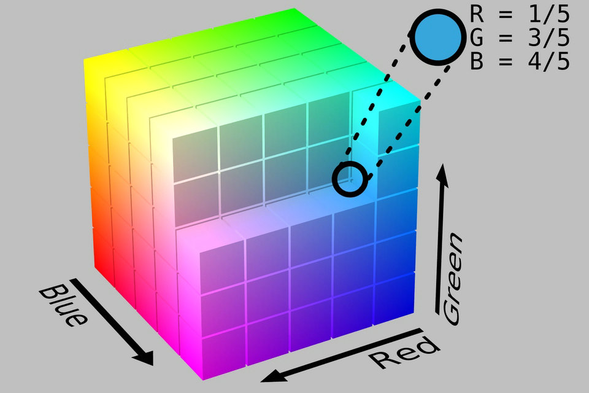

 

#### - What RGB stands for?

RGB means Red Green Blue, ie the primary colors in additive color synthesis.

A RGB file consists of composite layers of Red, Gree and Blue, each being coded on 256 levels from 0 to 255. For example, black corresponds to the levels R=0, G=0, B=0, and white corresponds to the levels R=255, G=255, B=255.

---

*RGB, Kırmızı Yeşil Mavi anlamına gelir, yani katkılı renk sentezindeki ana renkler.*

*Bir RGB dosyası, her biri 0 ila 255 arasında 256 düzeyde kodlanmış Kırmızı, Yeşil ve Mavi bileşik katmanlarından oluşur. Örneğin siyah, R=0, G=0, B=0 düzeylerine ve beyaz, R=255, G=255, B=255 düzeylerine karşılık gelir.*

#### - In Python, can we transform from one color space to another?

**OpenCV-Python** is a library of Python bindings designed to solve computer vision problems. `cv2.cvtColor()` method is used to convert an image from one color space to another. There are more than 150 color-space conversion methods available in OpenCV.

> **Syntax:** cv2.cvtColor(src, code[, dst[, dstCn]])  
**Parameters:  
src:** It is the image whose color space is to be changed.  
**code:** It is the color space conversion code.  
**dst:** It is the output image of the same size and depth as src image. It is an optional parameter.  
**dstCn:** It is the number of channels in the destination image. If the parameter is 0 then the number of the channels is derived automatically from src and code. It is an optional parameter.  
**Return Value:** It returns an image.

---

***OpenCV-Python**, bilgisayarla görme sorunlarını çözmek için tasarlanmış bir Python kitaplığıdır. `cv2.cvtColor()` yöntemi, bir görüntüyü bir renk uzayından diğerine dönüştürmek için kullanılır. OpenCV'de 150'den fazla renk alanı dönüştürme yöntemi mevcuttur.*

#### - What is the popular library for image processing?

OpenCV is one of the most famous and widely used open-source libraries for computer vision tasks such as image processing, object detection, face detection, image segmentation, face recognition, and many more. Other than this, it can also be used for machine learning tasks.

---

*OpenCV, görüntü işleme, nesne algılama, yüz algılama, görüntü bölütleme, yüz tanıma ve daha pek çok bilgisayarla görme görevleri için en ünlü ve yaygın olarak kullanılan açık kaynak kütüphanelerinden biridir. Bunun dışında makine öğrenimi görevleri için de kullanılabilir.*

### Converting into Tensor

#### - Computational Graph

A computational graph is defined as a directed graph where the nodes correspond to mathematical operations. Computational graphs are a way of expressing and evaluating a mathematical expression. 

For example, here is a simple mathematical equation; 

$p = x + y$

We can draw a computational graph of the above equation as follows.

Source: [https://www.tutorialspoint.com/python_deep_learning/python_deep_learning_computational_graphs.htm](https://www.tutorialspoint.com/python_deep_learning/python_deep_learning_computational_graphs.htm)

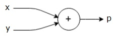

 

---

*Bir hesaplama grafiği, düğümlerin matematiksel işlemlere karşılık geldiği yönlendirilmiş bir grafik olarak tanımlanır. Hesaplamalı grafikler, matematiksel bir ifadeyi ifade etmenin ve değerlendirmenin bir yoludur.*

*Örneğin, burada basit bir matematiksel denklem;*  

$p = x + y$

*Yukarıdaki denklemin hesaplama grafiğini aşağıdaki gibi çizebiliriz.*

 

#### - What is Tensor?

A Tensor is a mathematical object similar to, but more general than, a vector and often represented by an array of components that describe functions relevant to coordinates of a space. Put simply, a Tensor is an array of numbers that transform according to certain rules under a change of coordinates. A Tensor can be defined as a single point, a collection of isolated points, or it may be defined as a continuum of points in which elements of the tensor are functions of position, and the Tensor forms what is known as a Tensor field. This means that rather than being represented by a single point, the tensor is defined at multiple points together in a space.

As a cornerstone of machine learning system libraries like Tensorflow, Tensors are used by neural networks as components to describe and calculate phenomena. For example, a machine learning algorithm might use Tensors of order two, also called vectors, in calculating the descriptive characteristics of an electric field. As any point in the field is defined by both magnitude and direction, a vector, rather than a scalar, is the appropriate form of Tensor to be applied.

---

*Tensör, bir vektöre benzer, ancak ondan daha genel olan ve genellikle bir uzayın koordinatlarıyla ilgili işlevleri tanımlayan bir dizi bileşenle temsil edilen matematiksel bir nesnedir. Basitçe söylemek gerekirse, bir Tensör, bir koordinat değişikliği altında belirli kurallara göre dönüşen bir sayı dizisidir. Bir Tensör, tek bir nokta, izole edilmiş noktalar topluluğu olarak tanımlanabilir veya tensörün öğelerinin konumun fonksiyonları olduğu ve Tensörün Tensör alanı olarak bilinen şeyi oluşturduğu noktaların sürekliliği olarak tanımlanabilir. Bu, tek bir nokta ile temsil edilmek yerine, tensörün bir uzayda birden çok noktada birlikte tanımlanması anlamına gelir.*

*Tensorflow gibi makine öğrenimi sistem kitaplıklarının temel taşı olan Tensörler, sinir ağları tarafından fenomenleri tanımlamak ve hesaplamak için bileşenler olarak kullanılır. Örneğin, bir makine öğrenimi algoritması, bir elektrik alanının tanımlayıcı özelliklerini hesaplamak için vektörler olarak da adlandırılan ikinci dereceden Tensörleri kullanabilir. Alandaki herhangi bir nokta hem büyüklük hem de yön ile tanımlandığından, skaler yerine bir vektör, uygulanacak uygun Tensör biçimidir.*

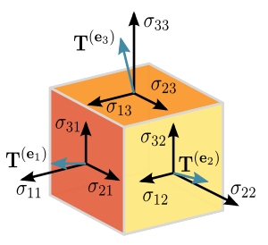

 

#### - One Hot Encoding

One hot encoding is a process by which categorical variables are converted into a form that could be provided to ML algorithms to do a better job in prediction.

---

*One hot encoding, kategorik değişkenlerin tahminde daha iyi bir iş yapmak için ML algoritmalarına sağlanabilecek bir forma dönüştürüldüğü bir süreçtir.*

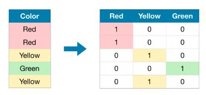

 

#### - What is CUDA programming?

CUDA is a parallel computing platform and programming model developed by Nvidia for general computing on its own GPUs (graphics processing units). CUDA enables developers to speed up compute-intensive applications by harnessing the power of GPUs for the parallelizable part of the computation.

---

*CUDA, Nvidia tarafından kendi GPU'larında (grafik işlem birimleri) genel hesaplama için geliştirilmiş bir paralel hesaplama platformu ve programlama modelidir. CUDA, geliştiricilerin hesaplamanın paralelleştirilebilir kısmı için GPU'ların gücünden yararlanarak bilgi işlem yoğun uygulamaları hızlandırmalarını sağlar.*

---
## Design Segmentation Model

### - What is the difference between CNN and Fully CNN (FCNN) ?

In a fully connected layer each neuron is connected to every neuron in the previous layer, and each connection has it's own weight. This is a totally general purpose connection pattern and makes no assumptions about the features in the data. It's also very expensive in terms of memory (weights) and computation (connections).

In contrast, in a convolutional layer each neuron is only connected to a few nearby (aka local) neurons in the previous layer, and the same set of weights (and local connection layout) is used for every neuron. This connection pattern only makes sense for cases where the data can be interpreted as spatial with the features to be extracted being spatially local (hence local connections only OK) and equally likely to occur at any input position (hence same weights at all positions OK). The typical use case for convolutional layers is for image data where, as required, the features are local (e.g. a "nose" consists of a set of nearby pixels, not spread all across the image), and equally likely to occur anywhere (in general case, that nose might be anywhere in the image).

The fewer number of connections and weights make convolutional layers relatively cheap (vs full connect) in terms of memory and compute power needed.

---

*Tam bağlantılı katmanda her nöron bir önceki katmandaki her nörona bağlıdır ve her bağlantının kendi ağırlığı vardır. Bu tamamen genel amaçlı bir bağlantı modelidir ve verilerdeki özellikler hakkında herhangi bir varsayımda bulunmaz. Ayrıca bellek (ağırlıklar) ve hesaplama (bağlantılar) açısından da çok pahalıdır.*

*Buna karşılık, evrişimli bir katmanda her nöron, önceki katmandaki yalnızca birkaç yakındaki (diğer bir deyişle yerel) nörona bağlıdır ve her nöron için aynı ağırlıklar (ve yerel bağlantı düzeni) kullanılır. Bu bağlantı modeli yalnızca, çıkarılacak özelliklerin uzamsal olarak yerel olduğu (dolayısıyla yalnızca yerel bağlantılar) ve herhangi bir giriş konumunda eşit olarak meydana gelme olasılığı (dolayısıyla tüm konumlarda aynı ağırlıklar) ile verilerin uzamsal olarak yorumlanabileceği durumlar için anlamlıdır. . Evrişimli katmanlar için tipik kullanım durumu, gerektiğinde özelliklerin yerel olduğu (örneğin, bir "burun" görüntünün tamamına yayılmayan bir dizi yakın pikselden oluşur) ve eşit derecede herhangi bir yerde (içinde) meydana gelme olasılığı olan görüntü verileri içindir. genel durumda, bu burun görüntünün herhangi bir yerinde olabilir).*

*Daha az sayıda bağlantı ve ağırlık, gereken bellek ve hesaplama gücü açısından evrişimli katmanları nispeten ucuz hale getirir (tam bağlantıya kıyasla).*

### - What are the different layers on CNN?

There are five different layers in CNN

- Input layer
- Convo layer (Convo + ReLU)
- Pooling layer
- Fully connected(FC) layer
- Softmax/logistic layer
- Output layer

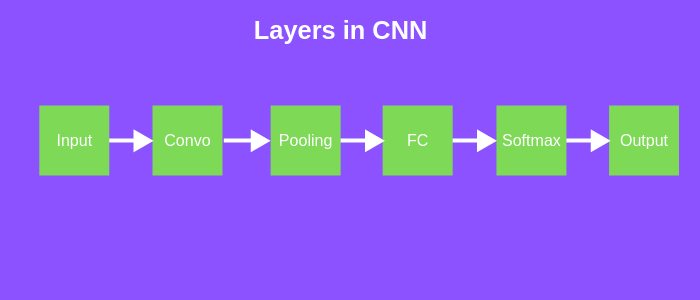

 

#### Input Layer

Input layer in CNN should contain image data. Image data is represented by three dimensional matrix as we saw earlier. You need to reshape it into a single column. Suppose you have image of dimension 28 x 28 =784, you need to convert it into 784 x 1 before feeding into input. If you have “m” training examples then dimension of input will be (784, m).

#### Convo Layer

First of all, a part of image is connected to Convo layer to perform convolution operation as we saw earlier and calculating the dot product between receptive field(it is a local region of the input image that has the same size as that of filter) and the filter. Result of the operation is single integer of the output volume. Then we slide the filter over the next receptive field of the same input image by a Stride and do the same operation again. We will repeat the same process again and again until we go through the whole image. The output will be the input for the next layer.

Convo layer also contains ReLU activation to make all negative value to zero.

#### Pooling Layer

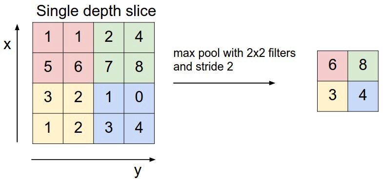

 

Pooling layer is used to reduce the spatial volume of input image after convolution. It is used between two convolution layer. If we apply FC after Convo layer without applying pooling or max pooling, then it will be computationally expensive and we don’t want it. So, the max pooling is only way to reduce the spatial volume of input image. In the above example, we have applied max pooling in single depth slice with Stride of 2. You can observe the 4 x 4 dimension input is reduce to 2 x 2 dimension.

There is no parameter in pooling layer but it has two hyperparameters — Filter(F) and Stride(S).

In general, if we have input dimension W1 x H1 x D1, then

W2 = (W1−F)/S+1

H2 = (H1−F)/S+1

D2 = D1

Where W2, H2 and D2 are the width, height and depth of output.

#### Fully Connected Layer(FC)

Fully connected layer involves weights, biases, and neurons. It connects neurons in one layer to neurons in another layer. It is used to classify images between different category by training.

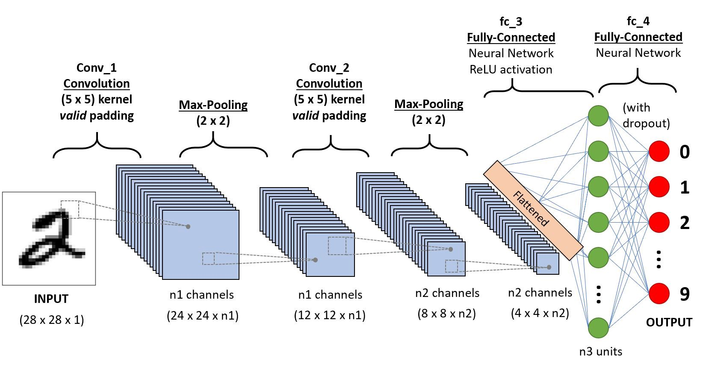

 

#### Softmax / Logistic Layer

Softmax or Logistic layer is the last layer of CNN. It resides at the end of FC layer. Logistic is used for binary classification and softmax is for multi-classification.

#### Output Layer

Output layer contains the label which is in the form of one-hot encoded.

Source: [https://towardsdatascience.com/covolutional-neural-network-cb0883dd6529](https://towardsdatascience.com/covolutional-neural-network-cb0883dd6529)

### - What is activation function ? Why is softmax usually used in the last layer?

An activation function is a function used in artificial neural networks which output a small value for small inputs and a larger value if its inputs exceed a threshold. If the inputs are large enough, the activation function “fires.” Otherwise, it does nothing. In other words, an activation function is like a gate that checks that an incoming value is greater than a critical number. The non-linear functions are known to be the most used activation functions. It makes it easy for a neural network model to adapt to a variety of data and to differentiate between the outcomes. The purpose of the activation function is to introduce non-linearity into the output of a neuron.

A neural network is essentially just a linear regression model without an activation function. The activation function does the non-linear transformation to the input making it capable to learn and perform more complex tasks.

Many multi-layer neural networks end in a penultimate layer that outputs real-valued scores that are not conveniently scaled and which may be difficult to work with. Here the softmax is very useful because it converts the scores to a normalized probability distribution, which can be displayed to a user or used as input to other systems. For this reason, it is usual to append a softmax function as the final layer of the neural network.

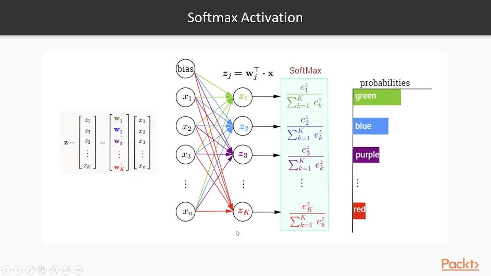

 

---
## Train

### - What is parameter and hyper-parameter in NN ?

A model parameter is a configuration variable internal to the model and whose value can be estimated from data. Parameters are key to machine learning algorithms. They are the part of the model that is learned from historical training data. These are the coefficients of the model, and the model itself chooses them. It means that the algorithm, while learning, optimizes these coefficients (according to a given optimization strategy) and returns an array of parameters that minimize the error.

**Hyperparameters**: these are elements that, differently from the previous ones, you need to set. Furthermore, the model will not update them according to the optimization strategy: your manual intervention will always be needed.

- Number of hidden layers
- Learning rate
- Momentum
- Activation function
- Minibatch size
- Epochs
- Dropout rate

### - Validation Dataset

The sample of data used to provide an unbiased evaluation of a model fit on the training dataset while tuning model hyperparameters. The evaluation becomes more biased as a skill on the validation dataset is incorporated into the model configuration. The validation set is used to evaluate a given model, but this is for frequent evaluation. Hence the model occasionally sees this data but never does it “Learn” from this. We use the validation set results, and update higher level hyperparameters. So the validation set affects a model, but only indirectly. The validation set is also known as the Dev set or the Development set. This makes sense since this dataset helps during the “development” stage of the model.

### - What is an epoch?

The number of epochs is a hyperparameter that defines the number of times that the learning algorithm will work through the entire training dataset. One epoch means that each sample in the training dataset has had an opportunity to update the internal model parameters. An epoch is comprised of one or more batches.

### - What is batch?

The batch size is a hyperparameter that defines the number of samples to work through before updating the internal model parameters.

### - What is iteration?

For each complete epoch, we have several iterations. Iteration is the number of batches or steps through partitioned packets of the training data, needed to complete one epoch. if you have 1000 training examples, and your batch size is 500, then it will take 2 iterations to complete 1 epoch. So then it will take x/y iterations to complete 1 epoch.

### - What is the Cost Function?

It is a function that measures the performance of a Machine Learning model for given data. Cost Function quantifies the error between predicted values. A cost function measures “how good” a neural network did concerning its given training sample and the expected output. It also may depend on variables such as weights and biases.)

### - What is/are the purpose(s) of an optimizer in NN?

Optimizers are algorithms or methods used to change the attributes of the neural network such as weights and learning rate to **reduce the losses**. How you should change the weights or learning rates of your neural network to reduce the losses is defined by the optimizers you use. Optimization algorithms are responsible for reducing the losses and providing the most accurate results possible.

 

### - What is Batch Gradient Descent & Stochastic Gradient Descent?

In Batch Gradient Descent, all the training data is taken into consideration to take a single step. We take the average of the gradients of all the training examples and then use that mean gradient to update our parameters. So that’s just one step of gradient descent in one epoch. In Stochastic Gradient Descent (SGD), we consider just one example at a time to take a single step. We do the following steps in one epoch for SGD:

1. Take an example
2. Feed it to Neural Network
3. Calculate its gradient
4. Use the gradient we calculated in step 3 to update the weights
5. Repeat steps 1–4 for all the examples in training dataset

SGD can be used for larger datasets. It converges faster when the dataset is large as it causes updates to the parameters more frequently.

### - What is Backpropogation ? What is used for ?

Artificial neural networks use backpropagation as a learning algorithm to compute a gradient descent for weights. Desired outputs are compared to achieved system outputs, and then the systems are tuned by adjusting connection weights to narrow the difference between the two as much as possible. The algorithm gets its name because the weights are updated backward, from output towards input. A neural network propagates the signal of the input data forward through its parameters towards the moment of decision and then backpropagates information about the error, in reverse through the network, so that it can alter the parameters. This happens step by step:

1. The network guesses data, using its parameters
2. The network is measured with a loss function
3. The error is backpropagated to adjust the wrong-headed parameters

Backpropagation takes the error associated with a wrong guess by a neural network and uses that error to adjust the neural network’s parameters in the direction of less error.

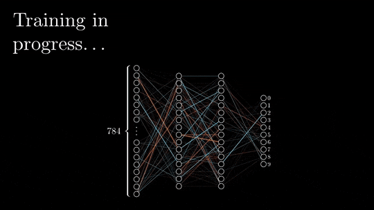

 
