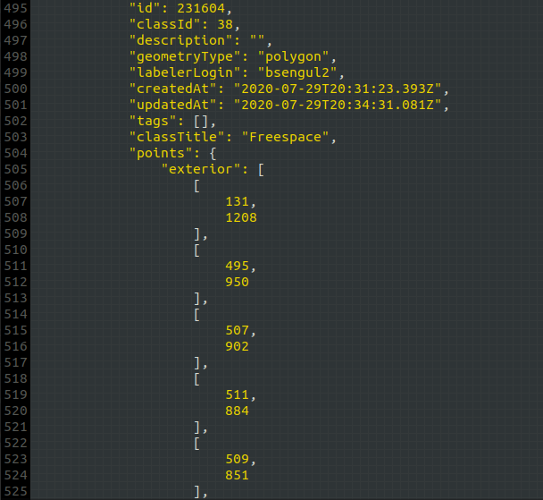
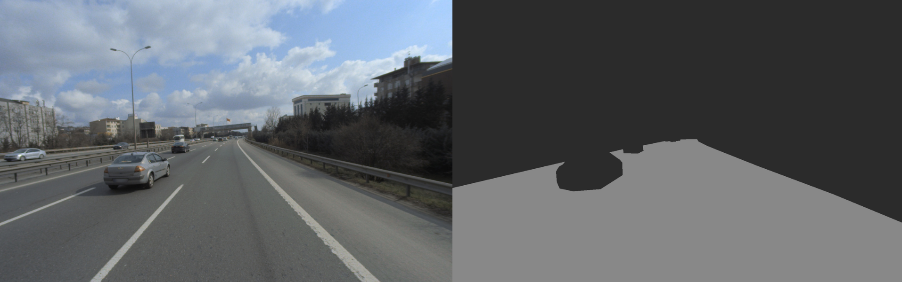

# Freespace Segmentation with Fully Convolutional Neural Network (FCNN)
Drivable area detection in highway images with semantic segmentation.

The project was developed with technologies such as **Python**, **Pytorch**, **opencv**.

Below are the image used while testing the model, the expected output from the model, and the drivable fields that the model predicts;

 

[Click here](/Questions_and_Answers.md) for the question and answer page that includes basic information about semantic segmentation and deep learning.

## Parts of the project;
- [Json to Mask](#json-to-mask)
- [Mask on Image](#mask-on-image)
- [Preprocess](#preprocess)
- [Model](#model)
- [Train](#train)
- [Data Augmentation](#data-augmentation)
- [Predict](#predict)

## Json to Mask
JSON files are obtained as a result of highway images tagged by Ford Otosan Data Annotation Team. The JSON files contain the exterior and interior point locations of the freespace (drivable area) class. 

The file structure is as follows;

 

A mask was created with the data in the JSON file to identify the pixels with freespace in the image.

The `fillPoly` function from the cv2 library was used to draw the masks.

    for obj in json_dict["objects"]:
        if obj["classTitle"]=="Freespace":
            cv2.fillPoly(mask, np.array([obj["points"]["exterior"]], dtype=np.int32), color=100)
            
            if obj["points"]["interior"] != []:
                for interior in obj["points"]["interior"]:
                    cv2.fillPoly(mask, np.array([interior], dtype=np.int32), color=0)

Mask example;

 

## Mask on Image

## Preprocess

## Model

## Train

## Data Augmentation

## Predict

