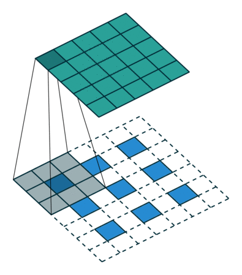

# Freespace Segmentation with Fully Convolutional Neural Network (FCNN)
Drivable area detection in highway images with semantic segmentation.

The project was developed with technologies such as **Python**, **Pytorch**, **opencv**.

Below are the image used while testing the model, the expected output from the model, and the drivable fields that the model predicts;

 

In the model training, 8.555 image data collected from the highway by Ford Otosan were used. Examples from the dataset;

 

**You can review my notes, which contain basic information about semantic segmentation and deep learning, under the following headings;**
- [What is Machine Learning?](/Questions_and_Answers.md#--what-is-machine-learning)
- [What is Unsupervised vs Supervised learning difference?](/Questions_and_Answers.md#--what-is-unsupervised-vs-supervised-learning-difference)
- [What is Deep Learning?](/Questions_and_Answers.md#--what-is-deep-learning)
- [What is Neural Network (NN)?](/Questions_and_Answers.md#--what-is-neural-network-nn)
- [What is Convolution Neural Network (CNN)?](/Questions_and_Answers.md#--what-is-convolution-neural-network-cnn-please-give-2-advantages-over-nn)
- [What is segmentation task in NN? Is it supervised or unsupervised?](/Questions_and_Answers.md#--what-is-segmentation-task-in-nn-is-it-supervised-or-unsupervised)
- [What is classification task in NN? Is it supervised or unsupervised?](/Questions_and_Answers.md#--what-is-classification-task-in-nn-is-it-supervised-or-unsupervised)
- [Compare segmentation and classification in NN.](/Questions_and_Answers.md#--compare-segmentation-and-classification-in-nn)
- [What is data and dataset difference?](/Questions_and_Answers.md#--what-is-data-and-dataset-difference)
- [What is the difference between supervised and unsupervised learning in terms of dataset?](/Questions_and_Answers.md#--what-is-the-difference-between-supervised-and-unsupervised-learning-in-terms-of-dataset)

## Parts of the project;
- [Json to Mask](#json-to-mask)
- [Mask on Image](#mask-on-image)
- [Preprocess](#preprocess)
- [Model](#model)
- [Train](#train)
- [Predict](#predict)
- [Data Augmentation](#data-augmentation)

## Json to Mask
JSON files are obtained as a result of highway images tagged by Ford Otosan Annotation Team. The JSON files contain the exterior and interior point locations of the freespace (drivable area) class. 

The file structure is as follows;

 

A mask was created with the data in the JSON file to identify the pixels with freespace in the image.

The `fillPoly` function from the cv2 library was used to draw the masks.

    for obj in json_dict["objects"]:
        if obj["classTitle"]=="Freespace":
            cv2.fillPoly(mask, np.array([obj["points"]["exterior"]], dtype=np.int32), color=100)
            
            if obj["points"]["interior"] != []:
                for interior in obj["points"]["interior"]:
                    cv2.fillPoly(mask, np.array([interior], dtype=np.int32), color=0)

Mask example;

 

 

**Click for the codes of this section; [json2mask.py](src/json2mask.py)**

## Mask on Image

In this section, masks obtained from JSON files were added on the images and tested whether the masks were correct.

Adding on the image by coloring the pixels designated as freespace and with 50% opacity:

    image[mask==100, :] = (255, 0, 125)
    opac_image = (image/2 + cpy_image/2).astype(np.uint8)

Mask on image example:

**Click for the codes of this section; [mask_on_image.py](src/mask_on_image.py)**

## Preprocess

The images and masks refer to "features" and "labels" for Segmentation. To feed them into the Segmentation model, which will be written in PyTorch, we need to format them appropriately.

**Image Normalization** is a process in which we change the range of pixel intensity values to make the image more familiar or normal to the senses.

	   img = cv2.imread(image_path)
	   zeros_img = np.zeros((1920, 1208))
	   norm_img = cv2.normalize(img, zeros_img, 0, 255, cv2.NORM_MINMAX)

Pytorch inputs must be in Tensor format.
Image to Tensor;

	    torch_image = torch.from_numpy(image_array).float()

The same procedures are applied to masks. 

In addition, one hot encoding was done. One Hot Encoding means binary representation of categorical variables. This process first requires the categorical values to be mapped to integer values. Then, each integer value is represented as a binary vector with all values zero except the integer index marked with 1.

    def one_hot_encoder(res_mask,n_classes):
		one_hot=np.zeros((res_mask.shape[0],res_mask.shape[1],n_classes),dtype=np.int)
		for i,unique_value in enumerate(np.unique(res_mask)):
			one_hot[:,:,i][res_mask==unique_value]=1
		return one_hot

One Hot Encoder output;

**Click for the codes of this section; [preprocess.py](src/preprocess.py)**

## Model

The U-Net model was used in the project. Because it is clear that one of the models that give the best results for semantic segmentation is U-Net. Semantic segmentation, also known as pixel-based classification, is an important task in which we classify each pixel of an image as belonging to a particular class. U-net is a encoder-decoder type network architecture for image segmentation. U-net has proven to be very powerful segmentation tool in scenarios with limited data. The ability of U-net to work with very little data and no specific requirement on input image size make it a strong candidate for image segmentation tasks.

- The **encoder** is the first half in the architecture diagram. Apply convolution blocks followed by a maxpool downsampling to encode the input image into feature representations at multiple different levels.

		self.maxpool = nn.MaxPool2d(2)

- The **decoder** is the second half of the architecture. The goal is to semantically project the discriminative features (lower resolution) learnt by the encoder onto the pixel space (higher resolution) to get a dense classification. The decoder consists of **upsampling** and **concatenation** followed by regular convolution operations.

		self.upsample = nn.Upsample(scale_factor=2,mode='bilinear', align_corners=True)
		 --
		 x = torch.cat([x, conv2], dim=1)

#### Activation Function
**ReLu** was used as the activation function.

- The  **rectified linear activation function**  or  **ReLU**  for short is a piecewise linear function that will output the input directly if it is positive, otherwise, it will output zero. It has become the default activation function for many types of neural networks because a model that uses it is easier to train and often achieves better performance.

	    nn.ReLu(inplace=True)

#### Output Layer

		x = nn.Softmax(dim=1)(x)
	
The **softmax** function is a function that turns a vector of K real values into a vector of K real values that sum to 1. The input values can be positive, negative, zero, or greater than one, but the softmax transforms them into values between 0 and 1, so that they can be interpreted as probabilities. If one of the inputs is small or negative, the softmax turns it into a small probability, and if an input is large, then it turns it into a large probability, but it will always remain between 0 and 1.

**Click for the codes of this section; [UNet_1.py](src/UNet_1.py)**

## Train

In this section, the U-Net model will be trained.

Tesla T4 GPU was used for training;

Parameters to be used while training the model;

    ######### PARAMETERS ##########
    valid_size = 0.3 # Rate of validation dataset
    test_size  = 0.1 # Rate of test dataset
    batch_size = 4   # Number of data to be processed simultaneously in the model
    epochs = 25      # Epoch count is the number of times all training data is shown to the network during training.
    cuda = True
    input_shape = input_shape
    n_classes = 2
    augmentation = True
    checkpoint = False
    model_name = "Unet_2-augmentation"
    cp_epoch = 0
    ###############################

Then Train, validation and test data were determined.

If the `augmentation` parameter is `True`, it performs augmentation on the training data and adds it to the list of train data.

    if augmentation:
        # PREPARE AUGMENTATED IMAGE AND MASK LISTS
        aug_image_list = glob.glob(os.path.join(AUG_IMAGE_DIR, "*"))
        aug_image_list.sort()
        aug_mask_list = glob.glob(os.path.join(AUG_MASK_DIR, "*"))
        aug_mask_list.sort()
        
        aug_size = int(len(aug_mask_list)/2)
        
        train_input_path_list = aug_image_list[:aug_size] + train_input_path_list + aug_image_list[aug_size:]
        train_label_path_list = aug_mask_list[:aug_size] + train_label_path_list + aug_mask_list[aug_size:]

Then, data is taken from the train data set to batch_size. It is convert to Tensor. It is given to the model. The output from the model is compared with what should be. And a loss value is obtained. It updates the parameters by propagating back to the network according to this loss value.

    # DEFINE LOSS FUNCTION AND OPTIMIZER
        criterion = nn.BCELoss()
        optimizer = optim.Adam(model.parameters(), lr=0.001)

Creates a criterion that measures the `Binary Cross Entropy` between target and output. The loss function can be a function of the mean square of the losses accumulated over the entire training dataset. Hence the weights are updated once at the end of each cycle.

The model is tested with validation data at the end of each epoch and the loss value is calculated.

	   for (valid_input_path, valid_label_path) in zip(valid_input_path_list, valid_label_path_list):
	       batch_input = tensorize_image([valid_input_path], input_shape, cuda)
	       batch_label = tensorize_mask([valid_label_path], input_shape, n_classes, cuda)
	       outputs = model(batch_input)
	       loss = criterion(outputs, batch_label)
	       val_losses.append(loss)
	       break

**Click for the codes of this section; [train.py](src/train.py)**

## Predict

To see the results of the trained model, estimation was done with test data never seen before by the model.

The images in the test data set are converted to tensor. It is given to the model. And the outputs are converted to masks. Then, these masks are printed on the images and the results are observed.

    # PREDICT
    def predict(model, images):
	    for image in tqdm_notebook(images):
            img = cv2.imread(image)
            batch_test = tensorize_image([image], input_shape, cuda)
            output = model(batch_test)
            out = torch.argmax(output, axis=1)
            out = out.cpu()
            outputs_list  = out.detach().numpy()
            mask = np.squeeze(outputs_list, axis=0)
            mask_uint8 = mask.astype('uint8')
            mask_resize = cv2.resize(mask_uint8, ((img.shape[1]), (img.shape[0])), interpolation = cv2.INTER_CUBIC)
            img_resize = cv2.resize(img, input_shape)
            mask_ind = mask_resize == 1
            copy_img = img.copy()
            img[mask_resize==1, :] = (255, 0, 125)
            opac_image = (img/2 + copy_img/2).astype(np.uint8)
            cv2.imwrite(os.path.join(predict_path, image.split("/")[-1]), opac_image)

As a result of the train, good results were obtained on straight roads, but unsuccessful predictions were observed in situations with light differences such as tunnels.
The model was retrained by applying data augmentation to obtain better results.

## Data Augmentation

The brightness and contrast values of the Train data were changed and saved.

	for image in tqdm.tqdm(image_name_list):
	    img = Image.open(os.path.join(IMAGE_DIR, image))
	    color_aug = T.ColorJitter(brightness=0.4, contrast=0.4)
	    
	    img_aug = color_aug(img)
	    new_path = image[:-4] + "-1.jpg"
	    new_path = os.path.join(AUG_IMAGE_DIR, new_path)
	    img_aug = np.array(img_aug)
	    cv2.imwrite(new_path, img_aug)

The model was retrained with the duplicated train data set. New loss values and graph;

Examples of augmented data;

Predicted images;

